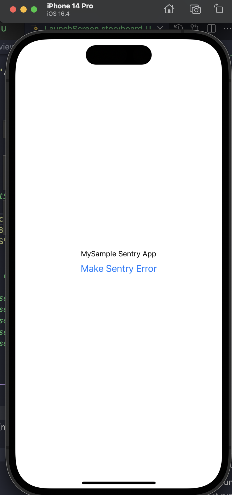

# Project with reproduceable react native build error of SentryPrivate module not found

This project is created to as a reference for [this issue](https://github.com/getsentry/sentry-react-native/issues/3186).
## Prerequisites

* node - v16.20.1 - make sure you have node 16 by default. This is needed to compile `main.jsbundle` . To set a specific version of node to use to compile main.jsbundle, you need to do the following:
  In Xcode in MyAppTestSentry target got o Build Phases, and in Bundle React Native code and images change export `NODE_BINARY=node` to `NODE_BINARY=/full/path/to/node-v.16.20.1`

* `cd ios; bundle install` - to install fastlane dependencies

* set your own sentry `dsn`` in App.tsx file. Change this line:
    `dsn: "https://1234@o1234.ingest.sentry.io/1234",` to your sentry dsn values.

* set your own values in `ios/sentry.properties`:
  ```
defaults.org=myapp-inc
defaults.project=react-native-test
auth.token=1234
  ```

* And other Apple prerequisites. You will need xcode, xcode commandline tools, have developer apple id and be logged in with this apple dev id on your xcode and MacOS.

### Install:
`yarn install`
`cd ios; pod install`

If having error with '/node->getLayout().hadOverflow() |' in ./node_modules/react-native/ReactCommon/yoga/yoga/Yoga.cpp
run this to fix it:
`yarn patch-pods`

## How to reproduce `module 'SentryPrivate' not found` using `xcodebuild`

xcodebuild -workspace ./MyAppTestSentry.xcworkspace -scheme MyAppTestSentry -configuration Debug -destination 'generic/platform=iOS' -archivePath /path/to/archive.xcarchive OTHER_CFLAGS="-Wno-documentation" archive

## How to reproduce `module 'SentryPrivate' not found` using Fastlane

`yarn build-ios-development`

## Example after successful build in Xcode:




